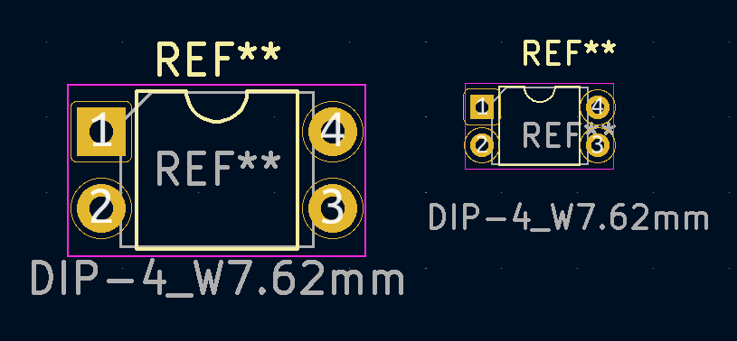
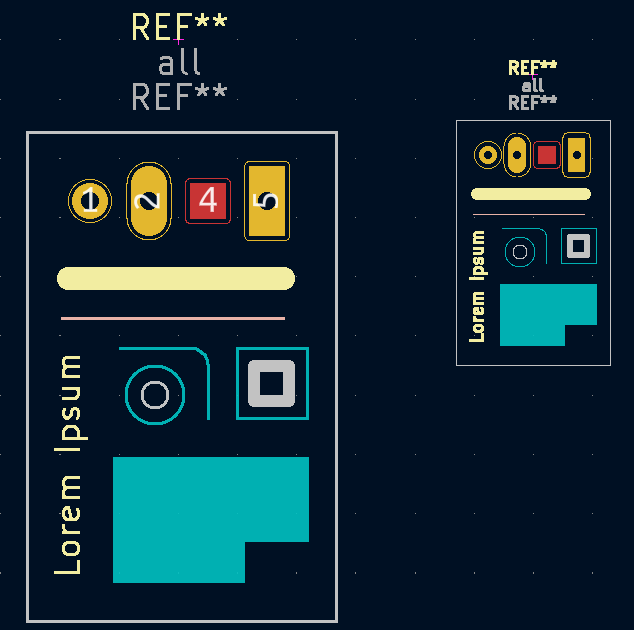

# KiCad-Footprint-Resizer
Application to resize KiCad footprints built using Streamlit

URL: https://inputblackboxoutput-kicad-footprint-resizer-app-bj5g74.streamlitapp.com/

|Library footprint|Image Convertor generated footprint|Custom footprint|
|--|--|--|
||||

## Made with lots of ⏱️, 📚 and ☕ by InputBlackBoxOutput
